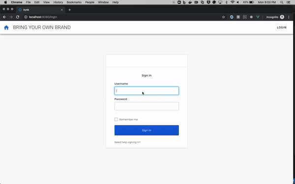

ℹ️ Disclaimer: This project is community-supported and is maintained by members of the Okta team for developers and other IT professionals. BYOB-dashboard is not an official Okta product and does not qualify for any Okta support. Okta makes no warranties regarding this project. Anyone who chooses to use this project must ensure that their implementation meets any applicable legal obligations including any Okta terms and conditions.

ℹ️ It is recommended that you collaborate with your preferred Okta Solution Provider [(link)](https://www.okta.com/partners/meet-our-partners/?field_partner_type_tid=8101&field_solutions_target_id=6061) to implement and adapt this app code sample within your existing portal. This app features frontend and backend components and like any web app hosted and running on your side, you should perform a code review, as well as security and scalability tests.

# BYOB Dashboard

**B**ring **Y**our **O**wn **B**rand...to the Okta Chicklet Page

## Introduction



If you've ever considered building your own User HomePage (aka the "Chicklet Page") – in order to have 100% control of the branding – and want some sample code to get started, you've found the right repo!

This project is built in Vue.js and uses

- [Vuetify 2.x](https://vuetifyjs.com/en/) Material Design Component Framework
- [Vuedraggable](https://github.com/SortableJS/Vue.Draggable) Vue drag-and-drop component based on Sortable.js
- [Okta Vue.js SDK](https://github.com/okta/okta-oidc-js/tree/master/packages/okta-vue)
- [Okta Sign-in Widget](https://github.com/okta/okta-signin-widget)

## Setup

Setting up the required configurations in Okta; the API Gateway and lambda functions (in AWS, for the [REST APIs](/byob-api)) are quite involved. So we've leveraged [Terraform](https://www.terraform.io/) and [Serverless](https://www.serverless.com), and provided a Makefile:

### Prerequisites

1. Install [terraform](https://learn.hashicorp.com/terraform/getting-started/install)

   - Skip if you prefer to [manually configure Okta](/terraform#manually-configure-okta)

2. Install [Serverless](https://www.serverless.com/framework/docs/getting-started/)

   e.g. via npm:

   ```
   npm install -g serverless
   ```

   Note: if you get WARN/ERR on MacOS, run:

   ```
   sudo npm install -g serverless
   ```

3. Create a Named Profile in AWS. [Steps](https://docs.idp.rocks/setup/#create-named-profile-in-aws-cli)
4. Enable Programmatic Access for Okta. [Steps](https://docs.idp.rocks/setup/#enable-programmatic-access-to-okta)

### Environment Variables

1. Copy the file `/terraform/terraform.tfvars.template` into `/terraform/terraform.tfvars` and edit it with your Org variables:

    ```
    org_name       = "<org subdomain>"
    base_url       = "<oktapreview.com || okta.com>"
    api_token      = "<OKTA_API_TOKEN>"
    app_url        = "http://localhost:8081"
    environment    = "dev"
    aws_region     = "us-east-1"
    aws_profile    = "(see Prerequisites Step 4.)"
    aws_ssm_prefix = "byob"
    recaptcha-site-secret = "<Google Recaptcha Site Secret>"
    ```

    Where the above variables are:

    | Variable              | Description                                                                | Default Value           |
    | --------------------- | :------------------------------------------------------------------------- | ----------------------- |
    | org_name              | Okta Org subdomain name (e.g. "atko")                                      |                         |
    | base_url              | Base URL for the Okta org (okta.com or oktapreview.com)                    | "okta.com"              |
    | api_token             | OKTA_API_TOKEN, per [Prerequisites Step 4.](#prerequisites)                |                         |
    | app_url               | Base URL for the SPA.                                                      | "http://localhost:8081" |
    | environment           | Stage configured in API Gateway (dev, prod, ...)                           | "dev"                   |
    | aws_region            | Region to deploy AWS components.                                           | "us-east-1"             |
    | aws_profile           | Profile configured in AWS CLI. per [Prerequisites Step 3.](#prerequisites) |                         |
    | aws_ssm_prefix        | Prefix for parameters created in AWS Parameter Store.                      | "byob"                  |
    | recaptcha-site-secret | Google Recaptcha Site Secret                                               |                         |

2. Copy the file `/byob-api/.env.json.template` into `.env.json` and edit it with corresponding values from the previous step:
    ```js
    {
        "AWS_PROFILE": "<aws_profile from above>",
        "AWS_REGION": "<aws_region from above>",
        "ENVIRONMENT": "<environment from above>"
    }
    ```


Once both `/terraform/terraform.tfvars` and `/byob-api/.env.json.local` are populated correctly, you can run the scripts to [setup Okta](#okta-setup) and [deploy the API](#spa-apis):

#### Okta Setup

- Use the provided Makefile:

  ```
  make okta
  ```

- Or if you prefer not to use the Makefile, follow [these](terraform#run-terraform) steps.

Head over to the [terraform](/terraform) folder for additional details.

#### SPA APIs

We've implemented user management (manage profile, password & factors) APIs using Serverless framework.

- Use the provided Makefile to deploy the api with serverless:

  ```
  make api
  ```

- Or if you prefer not to use the Makefile, follow [these](byob-api#deploy) steps.

Navigate to the [api folder](/byob-api) for more info.

## Single Page Application (Local Installation)

1. Prerequisite: Install [vuecli](https://cli.vuejs.org/#getting-started)

   e.g. via npm:

   ```
   npm install @vue/cli -g
   ```

   Note: if you get WARN/ERR on MacOS, run:

   ```
   sudo npm install -g @vue/cli --unsafe-perm
   ```

2. `cd` into `/byob-spa`, then:
3. Run `npm install`

   Note: if you get the error "gyp: No Xcode or CLT version detected!" on macOS Catalina, [follow these steps](https://medium.com/flawless-app-stories/gyp-no-xcode-or-clt-version-detected-macos-catalina-anansewaa-38b536389e8d)

4. Create env file `.env.development.local` (In that same `/byob-spa` directory. Note: there is an existing `.env` file. Do not touch that file; Add this `.local` in addition to it). Edit it in with the values below:

   ```
   VUE_APP_CLIENT_ID={{client_id}}
   VUE_APP_ISSUER={{issuer_uri}}
   VUE_APP_API={{api_base_url}}
   ```

   Where the above variables are:
   | Variable | Where to find |
   | --- |:------------- |
   | VUE_APP_CLIENT_ID | The `client_id` of the Okta App. In Okta, search for the app named `byob-dashboard` (that was provisioned by terraform) |
   | VUE_APP_ISSUER | The `issuer_uri` of the Auth Server. In Okta, search for the Authorization Server named `byob-dashboard` (that was provisioned by terraform) |
   | VUE_APP_API | The api base url of the API that was deployed in [SPA APIs step](#spa-apis) |

5. The following command compiles and hot-reloads for development environment
   `npm run serve`
6. Open your browser to `http://localhost:8081` and login

#### Compile and minify for production

```
npm run build
```

### Options

Head over to the [spa folder](/byob-spa) for details on how to enable some built-in options
