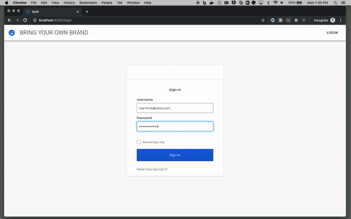

ℹ️ Disclaimer: This project is community-supported and is maintained by members of the Okta team for developers and other IT professionals. BYOB-dashboard is not an official Okta product and does not qualify for any Okta support. Okta makes no warranties regarding this project. Anyone who chooses to use this project must ensure that their implementation meets any applicable legal obligations including any Okta terms and conditions.

ℹ️ It is recommended that you collaborate with your preferred Okta Solution Provider [(link)](https://www.okta.com/partners/meet-our-partners/?field_partner_type_tid=8101&field_solutions_target_id=6061) to implement and adapt this app code sample within your existing portal. This app features frontend and backend components and like any web app hosted and running on your side, you should perform a code review, as well as security and scalability tests. 


# BYOB Dashboard
**B**ring **Y**our **O**wn **B**rand...to the Okta Chicklet Page

## Introduction


If you've ever considered building your own User HomePage (aka the "Chicklet Page") – in order to have 100% control of the branding – and want some sample code to get started, you've found the right repo!

This project is built in Vue.js and uses
* [Vuetify 2.x](https://vuetifyjs.com/en/) Material Design Component Framework
* [Vuedraggable](https://github.com/SortableJS/Vue.Draggable) Vue drag-and-drop component based on Sortable.js
* [Okta Vue.js SDK](https://github.com/okta/okta-oidc-js/tree/master/packages/okta-vue) 
* [Okta Sign-in Widget 3.x](https://github.com/okta/okta-signin-widget)

## Prerequisites
* Install [terraform](https://learn.hashicorp.com/terraform/getting-started/install)
    * Skip if you want to [manually configure Okta](/terraform)
* Install [vuecli](https://cli.vuejs.org/#getting-started)
    e.g. via npm:
    ```
    npm install @vue/cli -g
    ```
* Install [Serverless](https://www.serverless.com/framework/docs/getting-started/)
    e.g. via npm:
    ```
    npm install -g serverless
    ```

## Okta Setup
Use the provided Makefile:
```
make Okta
```

Or manually call the terraform scripts:
1. cd `/terraform`
2. run `terraform init && terraform plan -out=okta.setup.tfplan -lock=false`
3. run `terraform apply -auto-approve okta.setup.tfplan`

Head over to the [terraform](/terraform) folder for additioinal details.

### SPA APIs
We've implemented user management (manage profile, password & factors) APIs using Lambda and Amazon API Gateway. Navigate to the  [api folder](/byob-api) for more info.

Use the provided Makefile to deploy the api with serverless:
```
make api
```

### Front End (Local Installation)
1. `cd` into `/byob-spa`
2. Run `npm install`
3. Create env file `.env.development.local` in the root directory (There is an existing `.env` file. Do not touch that file, add this new file in addition to it). Edit it in with the values below:
```
VUE_APP_CLIENT_ID={{Your Client ID from the "Okta Org" setup}}
VUE_APP_ISSUER={{Your Issuer URI from the "Okta Org" setup}}
VUE_APP_API={{The [api](/byob-api) that was deployed in the previous step}}
```
4. The following command compiles and hot-reloads for development environment
`npm run serve`
5. Open your browser to `http://localhost:8080` and login

### Compile and minify for production
```
npm run build
```

### Options
Head over to the [spa folder](/byob-spa) for details on how to enable some built-in options
