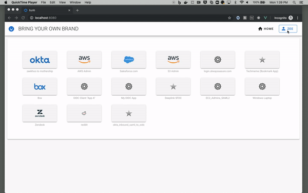
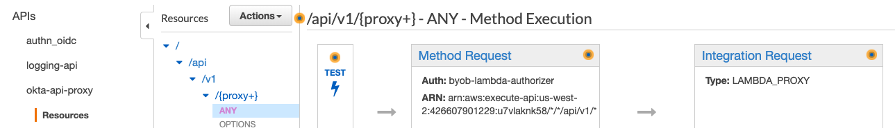

# Proxy API calls to Okta
The Single Page App (SPA) would need to call Okta APIs (*For Example, to update the users' own profile/password or configure factors, see [Manage Okta resources by API](https://developer.okta.com/docs/reference/#manage-okta-resources) for more info*) but the Okta API endpoints are protected by API keys ([SSWS key](https://developer.okta.com/docs/reference/api-overview/#authentication)) that cannot be stored on the client side. However, the SPA has an **access_token** that can authenticate its *own apis*. So in order to securely call Okta endpoints, the SPA would call its own API (protected by the access_token), and then the API (a Lambda, *which can store secrets*) proxies calls to Okta with the SSWS key.




# Deployment

## Step 1. Create 2 lambdas


Our sample project calls [POST /api/v1/users/${userId}](https://developer.okta.com/docs/reference/api/users/#update-profile) to update the user profile, and [POST /api/v1/users/${userId}/credentials/change_password](https://developer.okta.com/docs/reference/api/users/#change-password) to change password. We use a Amzaon API Gateway with a single lambda integration to proxy calls to the above Okta endpoints. To protect the API Gateway endpoint, we use a custom Lambda authorizer that validates access_token from the SPA app.

Create provided samples [byob-api-proxy-lambda-authorizer-sample](/api/byob-api-proxy-lambda-authorizer-sample) and [byob-api-proxy-sample](/api/byob-api-proxy-sample). These lambdas will be used in the next steps.

## Step 2. Create a proxy endpoint (to the Okta API) using Amazon API Gateway:
First, you'd need to create the [byob-api-proxy-sample](/api/byob-api-proxy-sample) lambda function, as instructed in Step 1 above.

1. From the Amazon API Gateway Console/UI, click **Create API**
2. Accept all defaults, and provide a name for **API name**
3. Click **Create API**
4. On the next screen, click **Actions** > **Create Resource** and provide following values:
    * Resource Name = **api**
    * Resource Path = **/api**
    * Enable API Gateway CORS = **N**
    * Click **Create Resource**
5. Create another resource under resource path **/api**. (Click **Actions** > **Create Resource** again):
    * Resource Name = **v1**
    * Resource Path = **/v1** 
    * Enable API Gateway CORS = **N**
    * Click **Create Resource**
6. Create a *proxy path* resource under resource path **/api/v1**. (Click **Actions** > **Create Resource** one more time):
    * Select **Configure as proxy resource** checkbox
    * Accept all the defaults *(resulting in Resource Name = **proxy**, Resource Path = **/api/v1/{proxy+}**)*
    * Set *Enable API Gateway CORS* = **Y**
    * Click **Create Resource**
7. In the next screen
    * Select *Integration type* = **Lambda Function Proxy**
    * Lambda Function = *name of the lambda function from [byob-api-proxy-sample](/api/byob-api-proxy-sample)*
    * Click **Save**
    * Click **Ok** when prompted about CORS

## Step 3. Add Lambda Authorizer to the proxy:
Create the [byob-api-proxy-lambda-authorizer-sample](/api/byob-api-proxy-lambda-authorizer-sample) lambda function, as instructed in Step 1, above. Then, configure the API Gateway from Step 2 to use the lambda authorizer to authorize API calls:

1. Select **Authorizers** in the left navigation pane
2. Click **Create New Authorizer**, then configure with these values:
    * Lambda Function = *name of the lambda function from [byob-api-proxy-lambda-authorizer-sample](/api/byob-api-proxy-lambda-authorizer-sample)*
    * Lambda Event Payload = **Token** (is defaulted for you)
    * Token Source = **Authorization**
    * Token Validation = **^Bearer [-0-9a-zA-z\.]*$**
    * Click **Create**
3. Click **Resources** in the left navigation pane *(to return to our API definition)*
4. Click into the (pink) **ANY** definition
5. Click into **Method Request**
6. Under Settings, change Authorization=NONE to Authorization=**(Authorizer that was just defined)**

## Step4. Deploy your API
1. Look for (and click) the button **Actions** > **Deploy API**
    * When prompted for **Stage** provide a value and click **Deploy**
2. After Deploy, You will immediately be taken to the **Stage Editor** screen. Copy the **Invoke URL** value
3. Add proxyApi={Invoke URL} to the `.config.js` config file. The file should look like:
```
export default {
    oidc: {
        client_id: '{{Your Client ID from the "Okta Org Setup" setup}}',
        issuer: 'https://{{Your Okta Org Url}}/oauth2/default',
        redirect_uri: '/implicit/callback',
        scope: 'openid profile email',
    },
    proxyApi: '{{Invoke URL}}'
}
```
