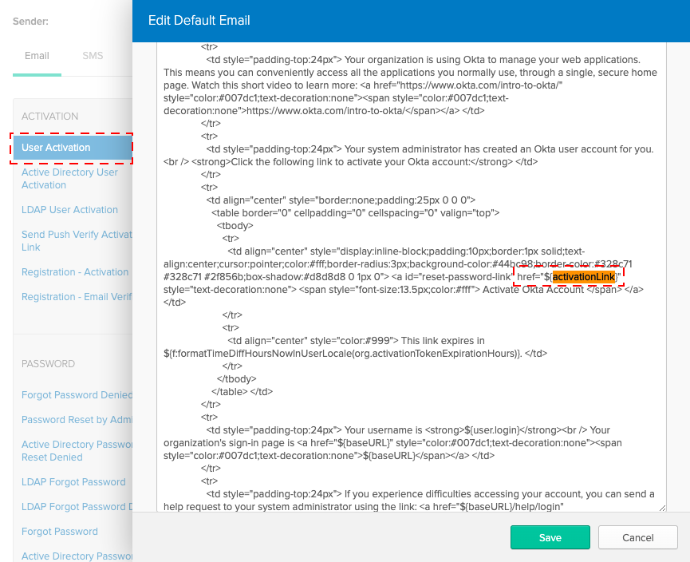

# Terraform
This application is represented by an OpenID Connect application in Okta, so we need to configure one. We'll use the [Okta Terraform Provider](https://www.terraform.io/docs/providers/okta/index.html) to automate this process.

## Prerequisites
* Install [terraform](https://learn.hashicorp.com/terraform/getting-started/install)

### Okta Setup

* Using the provided Makefile:

    `cd` to the `/byob-dashboard` (root) folder (that contains the Makefile) and run:
    ```
    make okta
    ```

* **(Optional)** Or, if you prefer not to use the Makefile, follow these steps.
    1. `cd` into the `/terraform` folder, then run
    2. `terraform init && terraform plan -out=okta.setup.tfplan -lock=false`
    3. `terraform apply -auto-approve okta.setup.tfplan`

* **(Optional) If you're more confortable manually configuring Okta,** refer to the manual steps [below](#manually-configure-okta).

---

## Manually Configure Okta
1. In your **Developer Console**, navigate to the **Applications** menu, click **Add Application** and select **Single-Page App**
2. Click **Next**, then enter an Application **Name**. Then:
   * Set Base URIs to `http://localhost:8081/`
   * Add an entry in *Redirect URIs*: `http://localhost:8081/oauth/callback`
   * Leave the default setting, Group assignments = **Everyone**
   * Select **Authorization Code** and deselect the default **Implicit** checkbox
3. Click **Done** to redirect back to the *General* tab of your application.
4. Make note of the **Client ID**, as it will be needed environment configuration. 
5. Make sure that **Use PKCE (for public clients)** (underneath the Client Id) is selected
6. Navigate to **Api** > **Trusted Origins** and add `http://localhost:8081` as a type = **CORS** entry.
7. Add a custom claim to the Auth Server you'll be using.: 
    * Name = `groups`
    * Value = `groups: matches regex.*`
    * Scopes = `Any`
    * Type = `id`
    * Included = `Always`
8. Update the __User Activation__ email template: Replace `${activationLink}` (see [screenshot below](#user-activation-email-screenshot)) with `http://localhost:8081/activate/${activationToken}` <a name="activation-email-template"></a>


